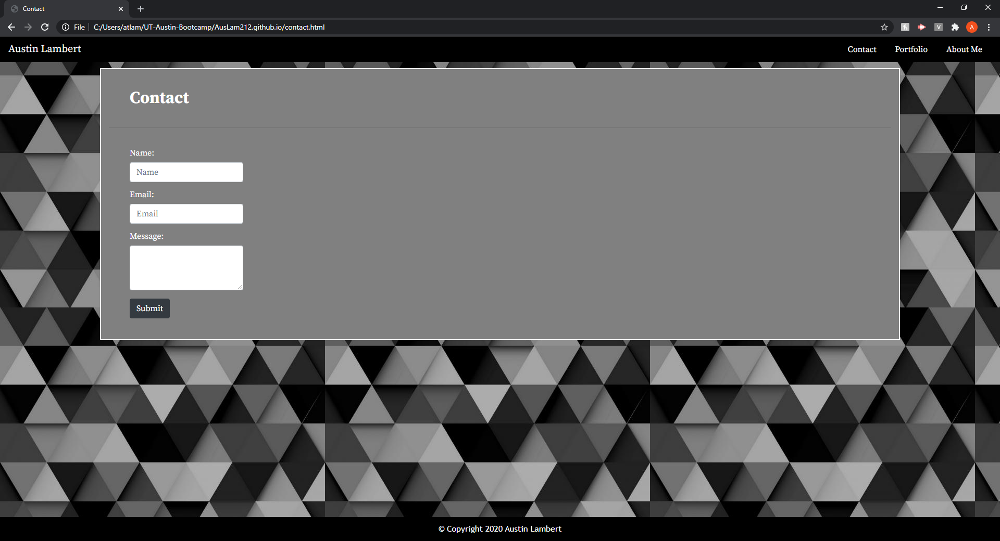

# My Portfolio

In this homework, I laid down the basic structure of html and css for my personal portfolio. I did this by creating 3 html files, respectively called index.html, portfolio.html, and contact.html. In this ReadMe.md I will go through the process of how I created my portfolio.

## Setting Up A Consistent Navbar and Footer

When creating my portfolio, the first thing I focused on was what elements I would need that would have to stay the same across all three files of html. When looking at this, I established that the navbar and footer were to be unchanging.

#### Headers Of All Three html

#### Footers Of All Three html

In the images you can see the the html stay consistent across all 3 files for the nav and footer elements. The nav is also nestled into a header tag to create a more semantic html.

## Setting Up Navbar Links

The second thing I focused on was establishing the navbar links that would lead to each page of the portfolio. Luckily, this was easily done by having an \<a> tag inside each navbar list item.
  

## Setting Up Bootsrtap Grid System

After establishing links to the other pages and a functional navbar/footer, I made sure to utilize Bootstraps grid system in my page. I also sought out early to add semantic html to the components of the grid system.

In the images, you can see that I set the grid system to respond to any change in screen size. Anything in the grid was set to take up 12 column out of 12 when minimized to the xs size.

## Formatting/CSS

Lastly I will go through my CSS and how I formatted the html.

#### CSS

In this CSS I tried to establish a general width for the container holding the grid system so that there would be margins on the sides at all sizes. I did this by adding a max width of 80% so that the container would always fill up that amount of the screen relative to the size of the application.I feel that this cleaned up the visual of the html when resized to be smaller.

#### Page Resizing Examples

These images show the resizing of each html page. Due to using the grid system provided by Bootstrap, I was able to reformat the documents to take up a full 12/12 columns when the screen size was xs, and I was able to format them to take up less space across a single row when in a larger screen size.

## Link

https://auslam212.github.io/
